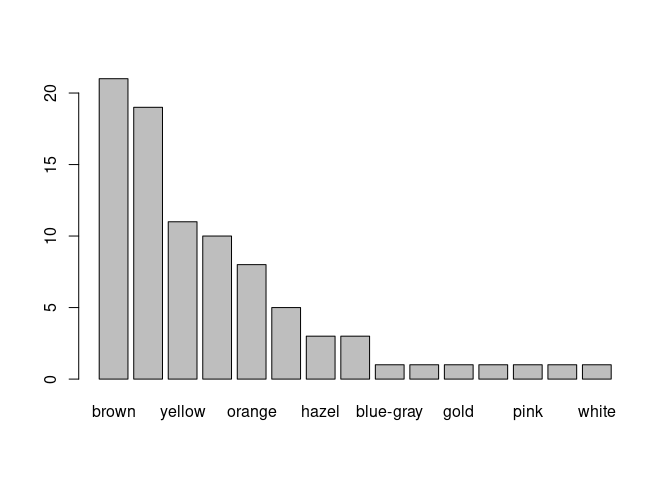
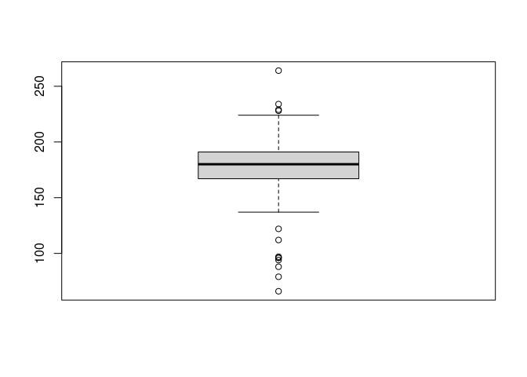
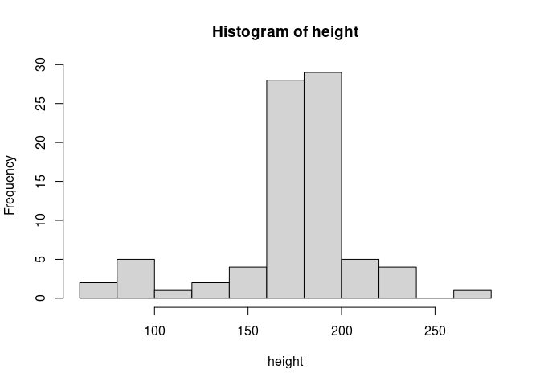

EDA of Star Wars Dataset
================

``` r
library(tidyverse)
```

    ## ── Attaching packages ─────────────────────────────────────── tidyverse 1.3.2 ──
    ## ✔ ggplot2 3.5.1     ✔ purrr   1.0.2
    ## ✔ tibble  3.2.1     ✔ dplyr   1.1.4
    ## ✔ tidyr   1.3.1     ✔ stringr 1.5.1
    ## ✔ readr   2.1.5     ✔ forcats 1.0.0
    ## ── Conflicts ────────────────────────────────────────── tidyverse_conflicts() ──
    ## ✖ dplyr::filter() masks stats::filter()
    ## ✖ dplyr::lag()    masks stats::lag()

``` r
data()
```

``` r
?starwars
```

``` r
dim(starwars)
```

    ## [1] 87 14

``` r
str(starwars)  # structure
```

    ## tibble [87 × 14] (S3: tbl_df/tbl/data.frame)
    ##  $ name      : chr [1:87] "Luke Skywalker" "C-3PO" "R2-D2" "Darth Vader" ...
    ##  $ height    : int [1:87] 172 167 96 202 150 178 165 97 183 182 ...
    ##  $ mass      : num [1:87] 77 75 32 136 49 120 75 32 84 77 ...
    ##  $ hair_color: chr [1:87] "blond" NA NA "none" ...
    ##  $ skin_color: chr [1:87] "fair" "gold" "white, blue" "white" ...
    ##  $ eye_color : chr [1:87] "blue" "yellow" "red" "yellow" ...
    ##  $ birth_year: num [1:87] 19 112 33 41.9 19 52 47 NA 24 57 ...
    ##  $ sex       : chr [1:87] "male" "none" "none" "male" ...
    ##  $ gender    : chr [1:87] "masculine" "masculine" "masculine" "masculine" ...
    ##  $ homeworld : chr [1:87] "Tatooine" "Tatooine" "Naboo" "Tatooine" ...
    ##  $ species   : chr [1:87] "Human" "Droid" "Droid" "Human" ...
    ##  $ films     :List of 87
    ##   ..$ : chr [1:5] "A New Hope" "The Empire Strikes Back" "Return of the Jedi" "Revenge of the Sith" ...
    ##   ..$ : chr [1:6] "A New Hope" "The Empire Strikes Back" "Return of the Jedi" "The Phantom Menace" ...
    ##   ..$ : chr [1:7] "A New Hope" "The Empire Strikes Back" "Return of the Jedi" "The Phantom Menace" ...
    ##   ..$ : chr [1:4] "A New Hope" "The Empire Strikes Back" "Return of the Jedi" "Revenge of the Sith"
    ##   ..$ : chr [1:5] "A New Hope" "The Empire Strikes Back" "Return of the Jedi" "Revenge of the Sith" ...
    ##   ..$ : chr [1:3] "A New Hope" "Attack of the Clones" "Revenge of the Sith"
    ##   ..$ : chr [1:3] "A New Hope" "Attack of the Clones" "Revenge of the Sith"
    ##   ..$ : chr "A New Hope"
    ##   ..$ : chr "A New Hope"
    ##   ..$ : chr [1:6] "A New Hope" "The Empire Strikes Back" "Return of the Jedi" "The Phantom Menace" ...
    ##   ..$ : chr [1:3] "The Phantom Menace" "Attack of the Clones" "Revenge of the Sith"
    ##   ..$ : chr [1:2] "A New Hope" "Revenge of the Sith"
    ##   ..$ : chr [1:5] "A New Hope" "The Empire Strikes Back" "Return of the Jedi" "Revenge of the Sith" ...
    ##   ..$ : chr [1:4] "A New Hope" "The Empire Strikes Back" "Return of the Jedi" "The Force Awakens"
    ##   ..$ : chr "A New Hope"
    ##   ..$ : chr [1:3] "A New Hope" "Return of the Jedi" "The Phantom Menace"
    ##   ..$ : chr [1:3] "A New Hope" "The Empire Strikes Back" "Return of the Jedi"
    ##   ..$ : chr "A New Hope"
    ##   ..$ : chr [1:5] "The Empire Strikes Back" "Return of the Jedi" "The Phantom Menace" "Attack of the Clones" ...
    ##   ..$ : chr [1:5] "The Empire Strikes Back" "Return of the Jedi" "The Phantom Menace" "Attack of the Clones" ...
    ##   ..$ : chr [1:3] "The Empire Strikes Back" "Return of the Jedi" "Attack of the Clones"
    ##   ..$ : chr "The Empire Strikes Back"
    ##   ..$ : chr "The Empire Strikes Back"
    ##   ..$ : chr [1:2] "The Empire Strikes Back" "Return of the Jedi"
    ##   ..$ : chr "The Empire Strikes Back"
    ##   ..$ : chr [1:2] "Return of the Jedi" "The Force Awakens"
    ##   ..$ : chr "Return of the Jedi"
    ##   ..$ : chr "Return of the Jedi"
    ##   ..$ : chr "Return of the Jedi"
    ##   ..$ : chr "Return of the Jedi"
    ##   ..$ : chr "The Phantom Menace"
    ##   ..$ : chr [1:3] "The Phantom Menace" "Attack of the Clones" "Revenge of the Sith"
    ##   ..$ : chr "The Phantom Menace"
    ##   ..$ : chr [1:3] "The Phantom Menace" "Attack of the Clones" "Revenge of the Sith"
    ##   ..$ : chr [1:2] "The Phantom Menace" "Attack of the Clones"
    ##   ..$ : chr "The Phantom Menace"
    ##   ..$ : chr "The Phantom Menace"
    ##   ..$ : chr "The Phantom Menace"
    ##   ..$ : chr [1:2] "The Phantom Menace" "Attack of the Clones"
    ##   ..$ : chr "The Phantom Menace"
    ##   ..$ : chr "The Phantom Menace"
    ##   ..$ : chr [1:2] "The Phantom Menace" "Attack of the Clones"
    ##   ..$ : chr "The Phantom Menace"
    ##   ..$ : chr "Return of the Jedi"
    ##   ..$ : chr [1:3] "The Phantom Menace" "Attack of the Clones" "Revenge of the Sith"
    ##   ..$ : chr "The Phantom Menace"
    ##   ..$ : chr "The Phantom Menace"
    ##   ..$ : chr "The Phantom Menace"
    ##   ..$ : chr "The Phantom Menace"
    ##   ..$ : chr [1:3] "The Phantom Menace" "Attack of the Clones" "Revenge of the Sith"
    ##   ..$ : chr [1:3] "The Phantom Menace" "Attack of the Clones" "Revenge of the Sith"
    ##   ..$ : chr [1:3] "The Phantom Menace" "Attack of the Clones" "Revenge of the Sith"
    ##   ..$ : chr [1:2] "The Phantom Menace" "Revenge of the Sith"
    ##   ..$ : chr [1:2] "The Phantom Menace" "Revenge of the Sith"
    ##   ..$ : chr [1:2] "The Phantom Menace" "Revenge of the Sith"
    ##   ..$ : chr "The Phantom Menace"
    ##   ..$ : chr [1:3] "The Phantom Menace" "Attack of the Clones" "Revenge of the Sith"
    ##   ..$ : chr [1:2] "The Phantom Menace" "Attack of the Clones"
    ##   ..$ : chr "Attack of the Clones"
    ##   ..$ : chr "Attack of the Clones"
    ##   ..$ : chr "Attack of the Clones"
    ##   ..$ : chr [1:2] "Attack of the Clones" "Revenge of the Sith"
    ##   ..$ : chr [1:2] "Attack of the Clones" "Revenge of the Sith"
    ##   ..$ : chr "Attack of the Clones"
    ##   ..$ : chr "Attack of the Clones"
    ##   ..$ : chr [1:2] "Attack of the Clones" "Revenge of the Sith"
    ##   ..$ : chr [1:2] "Attack of the Clones" "Revenge of the Sith"
    ##   ..$ : chr "Attack of the Clones"
    ##   ..$ : chr "Attack of the Clones"
    ##   ..$ : chr "Attack of the Clones"
    ##   ..$ : chr "Attack of the Clones"
    ##   ..$ : chr "Attack of the Clones"
    ##   ..$ : chr "Attack of the Clones"
    ##   ..$ : chr [1:2] "Attack of the Clones" "Revenge of the Sith"
    ##   ..$ : chr "Attack of the Clones"
    ##   ..$ : chr "Attack of the Clones"
    ##   ..$ : chr [1:2] "Attack of the Clones" "Revenge of the Sith"
    ##   ..$ : chr "Revenge of the Sith"
    ##   ..$ : chr "Revenge of the Sith"
    ##   ..$ : chr [1:2] "A New Hope" "Revenge of the Sith"
    ##   ..$ : chr [1:2] "Attack of the Clones" "Revenge of the Sith"
    ##   ..$ : chr "Revenge of the Sith"
    ##   ..$ : chr "The Force Awakens"
    ##   ..$ : chr "The Force Awakens"
    ##   ..$ : chr "The Force Awakens"
    ##   ..$ : chr "The Force Awakens"
    ##   ..$ : chr "The Force Awakens"
    ##  $ vehicles  :List of 87
    ##   ..$ : chr [1:2] "Snowspeeder" "Imperial Speeder Bike"
    ##   ..$ : chr(0) 
    ##   ..$ : chr(0) 
    ##   ..$ : chr(0) 
    ##   ..$ : chr "Imperial Speeder Bike"
    ##   ..$ : chr(0) 
    ##   ..$ : chr(0) 
    ##   ..$ : chr(0) 
    ##   ..$ : chr(0) 
    ##   ..$ : chr "Tribubble bongo"
    ##   ..$ : chr [1:2] "Zephyr-G swoop bike" "XJ-6 airspeeder"
    ##   ..$ : chr(0) 
    ##   ..$ : chr "AT-ST"
    ##   ..$ : chr(0) 
    ##   ..$ : chr(0) 
    ##   ..$ : chr(0) 
    ##   ..$ : chr "Snowspeeder"
    ##   ..$ : chr(0) 
    ##   ..$ : chr(0) 
    ##   ..$ : chr(0) 
    ##   ..$ : chr(0) 
    ##   ..$ : chr(0) 
    ##   ..$ : chr(0) 
    ##   ..$ : chr(0) 
    ##   ..$ : chr(0) 
    ##   ..$ : chr(0) 
    ##   ..$ : chr(0) 
    ##   ..$ : chr(0) 
    ##   ..$ : chr(0) 
    ##   ..$ : chr(0) 
    ##   ..$ : chr "Tribubble bongo"
    ##   ..$ : chr(0) 
    ##   ..$ : chr(0) 
    ##   ..$ : chr(0) 
    ##   ..$ : chr(0) 
    ##   ..$ : chr(0) 
    ##   ..$ : chr(0) 
    ##   ..$ : chr(0) 
    ##   ..$ : chr(0) 
    ##   ..$ : chr(0) 
    ##   ..$ : chr(0) 
    ##   ..$ : chr(0) 
    ##   ..$ : chr "Sith speeder"
    ##   ..$ : chr(0) 
    ##   ..$ : chr(0) 
    ##   ..$ : chr(0) 
    ##   ..$ : chr(0) 
    ##   ..$ : chr(0) 
    ##   ..$ : chr(0) 
    ##   ..$ : chr(0) 
    ##   ..$ : chr(0) 
    ##   ..$ : chr(0) 
    ##   ..$ : chr(0) 
    ##   ..$ : chr(0) 
    ##   ..$ : chr(0) 
    ##   ..$ : chr(0) 
    ##   ..$ : chr(0) 
    ##   ..$ : chr(0) 
    ##   ..$ : chr(0) 
    ##   ..$ : chr(0) 
    ##   ..$ : chr(0) 
    ##   ..$ : chr(0) 
    ##   ..$ : chr(0) 
    ##   ..$ : chr(0) 
    ##   ..$ : chr(0) 
    ##   ..$ : chr "Flitknot speeder"
    ##   ..$ : chr(0) 
    ##   ..$ : chr(0) 
    ##   ..$ : chr "Koro-2 Exodrive airspeeder"
    ##   ..$ : chr(0) 
    ##   ..$ : chr(0) 
    ##   ..$ : chr(0) 
    ##   ..$ : chr(0) 
    ##   ..$ : chr(0) 
    ##   ..$ : chr(0) 
    ##   ..$ : chr(0) 
    ##   ..$ : chr(0) 
    ##   ..$ : chr "Tsmeu-6 personal wheel bike"
    ##   ..$ : chr(0) 
    ##   ..$ : chr(0) 
    ##   ..$ : chr(0) 
    ##   ..$ : chr(0) 
    ##   ..$ : chr(0) 
    ##   ..$ : chr(0) 
    ##   ..$ : chr(0) 
    ##   ..$ : chr(0) 
    ##   ..$ : chr(0) 
    ##  $ starships :List of 87
    ##   ..$ : chr [1:2] "X-wing" "Imperial shuttle"
    ##   ..$ : chr(0) 
    ##   ..$ : chr(0) 
    ##   ..$ : chr "TIE Advanced x1"
    ##   ..$ : chr(0) 
    ##   ..$ : chr(0) 
    ##   ..$ : chr(0) 
    ##   ..$ : chr(0) 
    ##   ..$ : chr "X-wing"
    ##   ..$ : chr [1:5] "Jedi starfighter" "Trade Federation cruiser" "Naboo star skiff" "Jedi Interceptor" ...
    ##   ..$ : chr [1:3] "Naboo fighter" "Trade Federation cruiser" "Jedi Interceptor"
    ##   ..$ : chr(0) 
    ##   ..$ : chr [1:2] "Millennium Falcon" "Imperial shuttle"
    ##   ..$ : chr [1:2] "Millennium Falcon" "Imperial shuttle"
    ##   ..$ : chr(0) 
    ##   ..$ : chr(0) 
    ##   ..$ : chr "X-wing"
    ##   ..$ : chr "X-wing"
    ##   ..$ : chr(0) 
    ##   ..$ : chr(0) 
    ##   ..$ : chr "Slave 1"
    ##   ..$ : chr(0) 
    ##   ..$ : chr(0) 
    ##   ..$ : chr "Millennium Falcon"
    ##   ..$ : chr(0) 
    ##   ..$ : chr(0) 
    ##   ..$ : chr(0) 
    ##   ..$ : chr "A-wing"
    ##   ..$ : chr(0) 
    ##   ..$ : chr "Millennium Falcon"
    ##   ..$ : chr(0) 
    ##   ..$ : chr(0) 
    ##   ..$ : chr(0) 
    ##   ..$ : chr [1:3] "Naboo fighter" "H-type Nubian yacht" "Naboo star skiff"
    ##   ..$ : chr(0) 
    ##   ..$ : chr(0) 
    ##   ..$ : chr(0) 
    ##   ..$ : chr "Naboo Royal Starship"
    ##   ..$ : chr(0) 
    ##   ..$ : chr(0) 
    ##   ..$ : chr(0) 
    ##   ..$ : chr(0) 
    ##   ..$ : chr "Scimitar"
    ##   ..$ : chr(0) 
    ##   ..$ : chr(0) 
    ##   ..$ : chr(0) 
    ##   ..$ : chr(0) 
    ##   ..$ : chr(0) 
    ##   ..$ : chr(0) 
    ##   ..$ : chr(0) 
    ##   ..$ : chr(0) 
    ##   ..$ : chr(0) 
    ##   ..$ : chr(0) 
    ##   ..$ : chr(0) 
    ##   ..$ : chr(0) 
    ##   ..$ : chr(0) 
    ##   ..$ : chr "Jedi starfighter"
    ##   ..$ : chr(0) 
    ##   ..$ : chr "Naboo fighter"
    ##   ..$ : chr(0) 
    ##   ..$ : chr(0) 
    ##   ..$ : chr(0) 
    ##   ..$ : chr(0) 
    ##   ..$ : chr(0) 
    ##   ..$ : chr(0) 
    ##   ..$ : chr(0) 
    ##   ..$ : chr(0) 
    ##   ..$ : chr(0) 
    ##   ..$ : chr(0) 
    ##   ..$ : chr(0) 
    ##   ..$ : chr(0) 
    ##   ..$ : chr(0) 
    ##   ..$ : chr(0) 
    ##   ..$ : chr(0) 
    ##   ..$ : chr(0) 
    ##   ..$ : chr(0) 
    ##   ..$ : chr(0) 
    ##   ..$ : chr "Belbullab-22 starfighter"
    ##   ..$ : chr(0) 
    ##   ..$ : chr(0) 
    ##   ..$ : chr(0) 
    ##   ..$ : chr(0) 
    ##   ..$ : chr(0) 
    ##   ..$ : chr(0) 
    ##   ..$ : chr "X-wing"
    ##   ..$ : chr(0) 
    ##   ..$ : chr(0)

``` r
glimpse(starwars)
```

    ## Rows: 87
    ## Columns: 14
    ## $ name       <chr> "Luke Skywalker", "C-3PO", "R2-D2", "Darth Vader", "Leia Or…
    ## $ height     <int> 172, 167, 96, 202, 150, 178, 165, 97, 183, 182, 188, 180, 2…
    ## $ mass       <dbl> 77.0, 75.0, 32.0, 136.0, 49.0, 120.0, 75.0, 32.0, 84.0, 77.…
    ## $ hair_color <chr> "blond", NA, NA, "none", "brown", "brown, grey", "brown", N…
    ## $ skin_color <chr> "fair", "gold", "white, blue", "white", "light", "light", "…
    ## $ eye_color  <chr> "blue", "yellow", "red", "yellow", "brown", "blue", "blue",…
    ## $ birth_year <dbl> 19.0, 112.0, 33.0, 41.9, 19.0, 52.0, 47.0, NA, 24.0, 57.0, …
    ## $ sex        <chr> "male", "none", "none", "male", "female", "male", "female",…
    ## $ gender     <chr> "masculine", "masculine", "masculine", "masculine", "femini…
    ## $ homeworld  <chr> "Tatooine", "Tatooine", "Naboo", "Tatooine", "Alderaan", "T…
    ## $ species    <chr> "Human", "Droid", "Droid", "Human", "Human", "Human", "Huma…
    ## $ films      <list> <"A New Hope", "The Empire Strikes Back", "Return of the J…
    ## $ vehicles   <list> <"Snowspeeder", "Imperial Speeder Bike">, <>, <>, <>, "Imp…
    ## $ starships  <list> <"X-wing", "Imperial shuttle">, <>, <>, "TIE Advanced x1",…

``` r
View(starwars)
```

``` r
head(starwars)
```

    ## # A tibble: 6 × 14
    ##   name      height  mass hair_color skin_color eye_color birth_year sex   gender
    ##   <chr>      <int> <dbl> <chr>      <chr>      <chr>          <dbl> <chr> <chr> 
    ## 1 Luke Sky…    172    77 blond      fair       blue            19   male  mascu…
    ## 2 C-3PO        167    75 <NA>       gold       yellow         112   none  mascu…
    ## 3 R2-D2         96    32 <NA>       white, bl… red             33   none  mascu…
    ## 4 Darth Va…    202   136 none       white      yellow          41.9 male  mascu…
    ## 5 Leia Org…    150    49 brown      light      brown           19   fema… femin…
    ## 6 Owen Lars    178   120 brown, gr… light      blue            52   male  mascu…
    ## # ℹ 5 more variables: homeworld <chr>, species <chr>, films <list>,
    ## #   vehicles <list>, starships <list>

``` r
tail(starwars)
```

    ## # A tibble: 6 × 14
    ##   name      height  mass hair_color skin_color eye_color birth_year sex   gender
    ##   <chr>      <int> <dbl> <chr>      <chr>      <chr>          <dbl> <chr> <chr> 
    ## 1 Tion Med…    206    80 none       grey       black             NA male  mascu…
    ## 2 Finn          NA    NA black      dark       dark              NA male  mascu…
    ## 3 Rey           NA    NA brown      light      hazel             NA fema… femin…
    ## 4 Poe Dame…     NA    NA brown      light      brown             NA male  mascu…
    ## 5 BB8           NA    NA none       none       black             NA none  mascu…
    ## 6 Captain …     NA    NA none       none       unknown           NA fema… femin…
    ## # ℹ 5 more variables: homeworld <chr>, species <chr>, films <list>,
    ## #   vehicles <list>, starships <list>

``` r
attach(starwars)
names(starwars) # names of variables
```

    ##  [1] "name"       "height"     "mass"       "hair_color" "skin_color"
    ##  [6] "eye_color"  "birth_year" "sex"        "gender"     "homeworld" 
    ## [11] "species"    "films"      "vehicles"   "starships"

``` r
length(starwars)
```

    ## [1] 14

``` r
class(hair_color)
```

    ## [1] "character"

``` r
unique(hair_color)
```

    ##  [1] "blond"         NA              "none"          "brown"        
    ##  [5] "brown, grey"   "black"         "auburn, white" "auburn, grey" 
    ##  [9] "white"         "grey"          "auburn"        "blonde"

``` r
table(hair_color)
```

    ## hair_color
    ##        auburn  auburn, grey auburn, white         black         blond 
    ##             1             1             1            13             3 
    ##        blonde         brown   brown, grey          grey          none 
    ##             1            18             1             1            38 
    ##         white 
    ##             4

``` r
sort(table(hair_color), decreasing=TRUE)
```

    ## hair_color
    ##          none         brown         black         white         blond 
    ##            38            18            13             4             3 
    ##        auburn  auburn, grey auburn, white        blonde   brown, grey 
    ##             1             1             1             1             1 
    ##          grey 
    ##             1

``` r
View(sort(table(hair_color), decreasing=TRUE))
```

``` r
barplot(sort(table(eye_color), decreasing=TRUE))
```

<!-- -->

``` r
starwars %>%
  select(hair_color) %>%
  count(hair_color) %>%
  arrange(desc(n)) %>%
  View()
```

``` r
starwars[is.na(hair_color), ]
```

    ## # A tibble: 5 × 14
    ##   name      height  mass hair_color skin_color eye_color birth_year sex   gender
    ##   <chr>      <int> <dbl> <chr>      <chr>      <chr>          <dbl> <chr> <chr> 
    ## 1 C-3PO        167    75 <NA>       gold       yellow           112 none  mascu…
    ## 2 R2-D2         96    32 <NA>       white, bl… red               33 none  mascu…
    ## 3 R5-D4         97    32 <NA>       white, red red               NA none  mascu…
    ## 4 Greedo       173    74 <NA>       green      black             44 male  mascu…
    ## 5 Jabba De…    175  1358 <NA>       green-tan… orange           600 herm… mascu…
    ## # ℹ 5 more variables: homeworld <chr>, species <chr>, films <list>,
    ## #   vehicles <list>, starships <list>

``` r
View(starwars[is.na(hair_color), ])
```

``` r
class(height)
```

    ## [1] "integer"

``` r
length(height)
```

    ## [1] 87

``` r
summary(height)
```

    ##    Min. 1st Qu.  Median    Mean 3rd Qu.    Max.    NA's 
    ##    66.0   167.0   180.0   174.6   191.0   264.0       6

``` r
boxplot(height)
```

<!-- -->

``` r
hist(height)
```

<!-- -->
