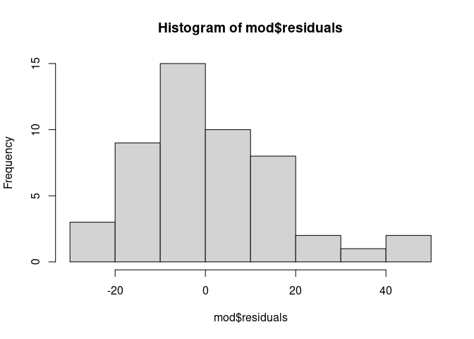

Linear Regression Models in R
================

``` r
library(tidyverse)
```

    ## ── Attaching packages ─────────────────────────────────────── tidyverse 1.3.2 ──
    ## ✔ ggplot2 3.5.1     ✔ purrr   1.0.2
    ## ✔ tibble  3.2.1     ✔ dplyr   1.1.4
    ## ✔ tidyr   1.3.1     ✔ stringr 1.5.1
    ## ✔ readr   2.1.5     ✔ forcats 1.0.0
    ## ── Conflicts ────────────────────────────────────────── tidyverse_conflicts() ──
    ## ✖ dplyr::filter() masks stats::filter()
    ## ✖ dplyr::lag()    masks stats::lag()

``` r
head(cars, 10)
```

    ##    speed dist
    ## 1      4    2
    ## 2      4   10
    ## 3      7    4
    ## 4      7   22
    ## 5      8   16
    ## 6      9   10
    ## 7     10   18
    ## 8     10   26
    ## 9     10   34
    ## 10    11   17

``` r
cars %>%
  lm(dist ~ speed, data=.) %>%
  summary()
```

    ## 
    ## Call:
    ## lm(formula = dist ~ speed, data = .)
    ## 
    ## Residuals:
    ##     Min      1Q  Median      3Q     Max 
    ## -29.069  -9.525  -2.272   9.215  43.201 
    ## 
    ## Coefficients:
    ##             Estimate Std. Error t value Pr(>|t|)    
    ## (Intercept) -17.5791     6.7584  -2.601   0.0123 *  
    ## speed         3.9324     0.4155   9.464 1.49e-12 ***
    ## ---
    ## Signif. codes:  0 '***' 0.001 '**' 0.01 '*' 0.05 '.' 0.1 ' ' 1
    ## 
    ## Residual standard error: 15.38 on 48 degrees of freedom
    ## Multiple R-squared:  0.6511, Adjusted R-squared:  0.6438 
    ## F-statistic: 89.57 on 1 and 48 DF,  p-value: 1.49e-12

``` r
mod <- lm(dist ~speed, data=cars)
mod
```

    ## 
    ## Call:
    ## lm(formula = dist ~ speed, data = cars)
    ## 
    ## Coefficients:
    ## (Intercept)        speed  
    ##     -17.579        3.932

``` r
summary(mod)
```

    ## 
    ## Call:
    ## lm(formula = dist ~ speed, data = cars)
    ## 
    ## Residuals:
    ##     Min      1Q  Median      3Q     Max 
    ## -29.069  -9.525  -2.272   9.215  43.201 
    ## 
    ## Coefficients:
    ##             Estimate Std. Error t value Pr(>|t|)    
    ## (Intercept) -17.5791     6.7584  -2.601   0.0123 *  
    ## speed         3.9324     0.4155   9.464 1.49e-12 ***
    ## ---
    ## Signif. codes:  0 '***' 0.001 '**' 0.01 '*' 0.05 '.' 0.1 ' ' 1
    ## 
    ## Residual standard error: 15.38 on 48 degrees of freedom
    ## Multiple R-squared:  0.6511, Adjusted R-squared:  0.6438 
    ## F-statistic: 89.57 on 1 and 48 DF,  p-value: 1.49e-12

``` r
attributes(mod)
```

    ## $names
    ##  [1] "coefficients"  "residuals"     "effects"       "rank"         
    ##  [5] "fitted.values" "assign"        "qr"            "df.residual"  
    ##  [9] "xlevels"       "call"          "terms"         "model"        
    ## 
    ## $class
    ## [1] "lm"

``` r
mod$residuals
```

    ##          1          2          3          4          5          6          7 
    ##   3.849460  11.849460  -5.947766  12.052234   2.119825  -7.812584  -3.744993 
    ##          8          9         10         11         12         13         14 
    ##   4.255007  12.255007  -8.677401   2.322599 -15.609810  -9.609810  -5.609810 
    ##         15         16         17         18         19         20         21 
    ##  -1.609810  -7.542219   0.457781   0.457781  12.457781 -11.474628  -1.474628 
    ##         22         23         24         25         26         27         28 
    ##  22.525372  42.525372 -21.407036 -15.407036  12.592964 -13.339445  -5.339445 
    ##         29         30         31         32         33         34         35 
    ## -17.271854  -9.271854   0.728146 -11.204263   2.795737  22.795737  30.795737 
    ##         36         37         38         39         40         41         42 
    ## -21.136672 -11.136672  10.863328 -29.069080 -13.069080  -9.069080  -5.069080 
    ##         43         44         45         46         47         48         49 
    ##   2.930920  -2.933898 -18.866307  -6.798715  15.201285  16.201285  43.201285 
    ##         50 
    ##   4.268876

``` r
hist(mod$residuals)
```

<!-- -->

``` r
new_speeds <- data.frame(speed = c(10, 15, 20))
```

``` r
predict(mod, new_speeds) %>% round(1)
```

    ##    1    2    3 
    ## 21.7 41.4 61.1

``` r
# same process with pipe operators
cars %>%
  lm(dist ~ speed, data=.) %>%
  predict(data.frame(speed = c(10,15,20))) %>%
  round()
```

    ##  1  2  3 
    ## 22 41 61
