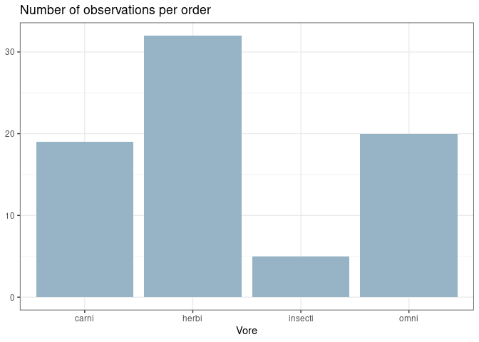
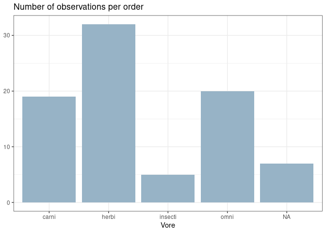
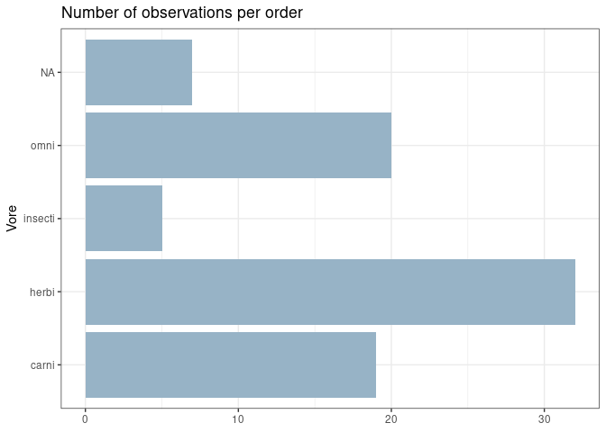
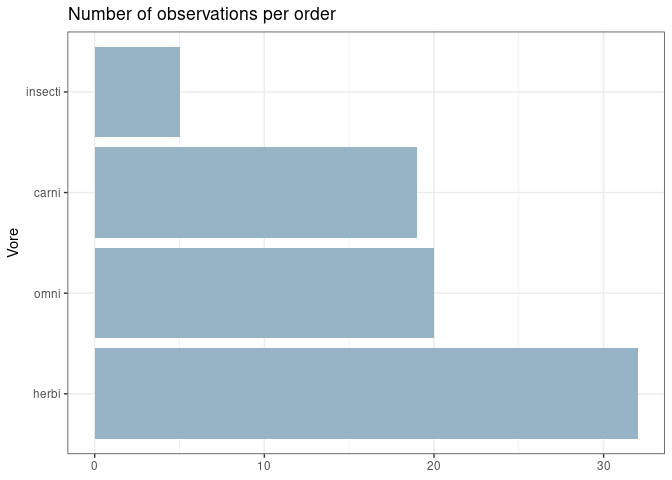
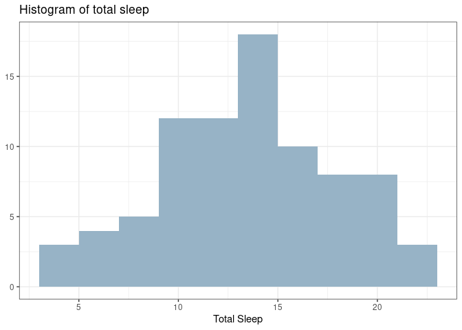
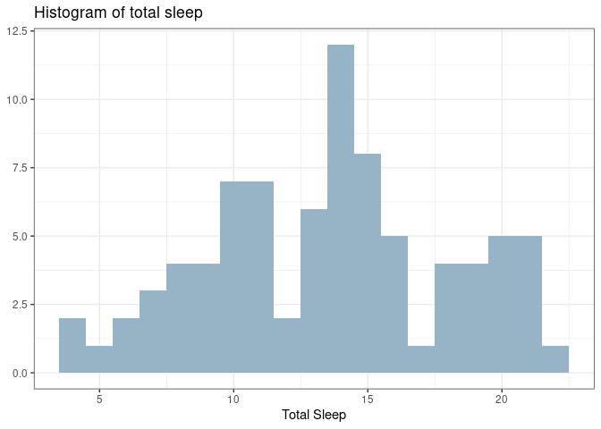
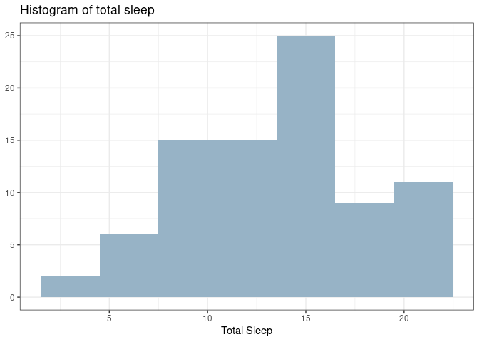

bar charts and histograms using ggplot
================

``` r
library(tidyverse)
```

    ## ── Attaching packages ─────────────────────────────────────── tidyverse 1.3.2 ──
    ## ✔ ggplot2 3.5.1     ✔ purrr   1.0.2
    ## ✔ tibble  3.2.1     ✔ dplyr   1.1.4
    ## ✔ tidyr   1.3.1     ✔ stringr 1.5.1
    ## ✔ readr   2.1.5     ✔ forcats 1.0.0
    ## ── Conflicts ────────────────────────────────────────── tidyverse_conflicts() ──
    ## ✖ dplyr::filter() masks stats::filter()
    ## ✖ dplyr::lag()    masks stats::lag()

``` r
View(msleep)
```

``` r
# single categorical
names(msleep)
```

    ##  [1] "name"         "genus"        "vore"         "order"        "conservation"
    ##  [6] "sleep_total"  "sleep_rem"    "sleep_cycle"  "awake"        "brainwt"     
    ## [11] "bodywt"

``` r
msleep %>%
  drop_na(vore) %>%
  ggplot(aes(x = vore))+
  geom_bar(fill = "#97B3C6")+
  theme_bw()+
  labs(x="Vore",
       y= NULL,
       title = "Number of observations per order")
```

<!-- -->

``` r
msleep %>%
  #drop_na(vore) %>%
  ggplot(aes(x = vore))+
  geom_bar(fill = "#97B3C6")+
  theme_bw()+
  labs(x="Vore",
       y= NULL,
       title = "Number of observations per order")
```

<!-- -->

``` r
msleep %>%
  #drop_na(vore) %>%
  ggplot(aes(x = vore))+
  geom_bar(fill = "#97B3C6")+
  coord_flip()+
  theme_bw()+
  labs(x="Vore",
       y= NULL,
       title = "Number of observations per order")
```

<!-- -->

``` r
msleep %>%
  drop_na(vore) %>%
  ggplot(aes(fct_infreq(vore)))+
  geom_bar(fill = "#97B3C6")+
  coord_flip()+
  theme_bw()+
  labs(x="Vore",
       y= NULL,
       title = "Number of observations per order")
```

<!-- -->

``` r
# single numeric
msleep %>%
  ggplot(aes(awake))+
  geom_histogram(binwidth=2, fill="#97B3C6")+
  theme_bw()+
  labs(x="Total Sleep",
       y= NULL,
       title = "Histogram of total sleep")
```

<!-- -->

``` r
msleep %>%
  ggplot(aes(awake))+
  geom_histogram(binwidth=1, fill="#97B3C6")+
  theme_bw()+
  labs(x="Total Sleep",
       y= NULL,
       title = "Histogram of total sleep")
```

<!-- -->

``` r
msleep %>%
  ggplot(aes(awake))+
  geom_histogram(binwidth=3, fill="#97B3C6")+
  theme_bw()+
  labs(x="Total Sleep",
       y= NULL,
       title = "Histogram of total sleep")
```

<!-- -->
