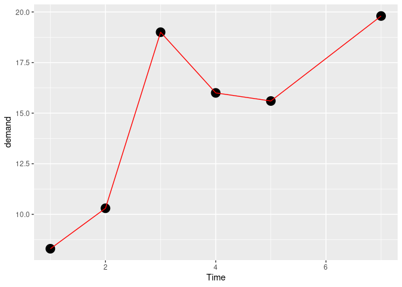
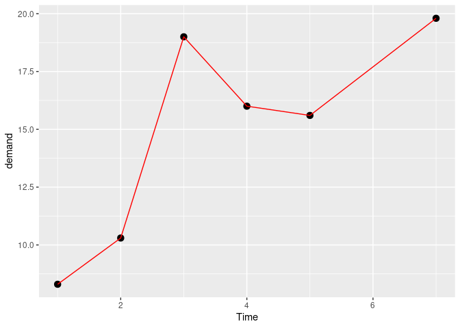
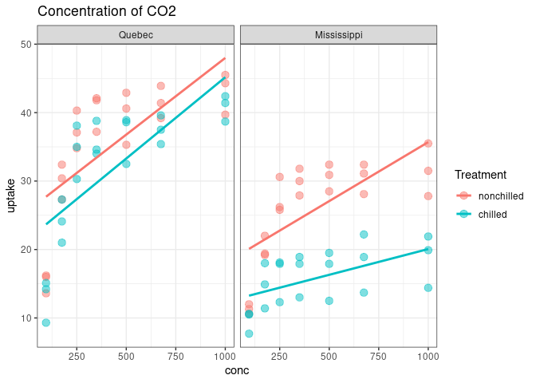
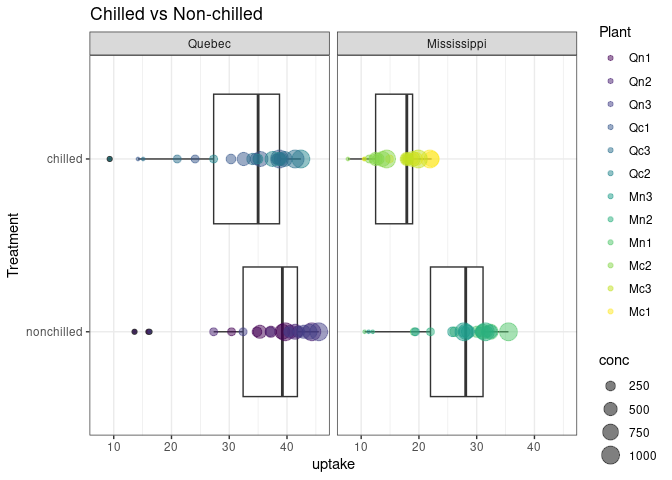
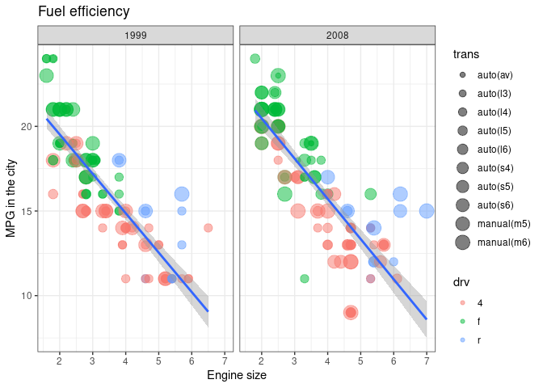

Data Visualization using ggplot2
================

``` r
### Data visualization

# data
# mapping (aesthetics)
# geometric representation
# statistics
# facet
# coordinate space
# labels
# theme

library(tidyverse)
```

    ## ── Attaching packages ─────────────────────────────────────── tidyverse 1.3.2 ──
    ## ✔ ggplot2 3.5.1     ✔ purrr   1.0.2
    ## ✔ tibble  3.2.1     ✔ dplyr   1.1.4
    ## ✔ tidyr   1.3.1     ✔ stringr 1.5.1
    ## ✔ readr   2.1.5     ✔ forcats 1.0.0
    ## ── Conflicts ────────────────────────────────────────── tidyverse_conflicts() ──
    ## ✖ dplyr::filter() masks stats::filter()
    ## ✖ dplyr::lag()    masks stats::lag()

``` r
BOD
```

    ##   Time demand
    ## 1    1    8.3
    ## 2    2   10.3
    ## 3    3   19.0
    ## 4    4   16.0
    ## 5    5   15.6
    ## 6    7   19.8

``` r
ggplot(data = BOD, 
       mapping = aes(x = Time, 
                     y = demand))+
  geom_point(size = 5)+
  geom_line(colour = "red")
```

<!-- -->

``` r
ggplot(BOD, aes(Time, demand))+
  geom_point(size=3)+
  geom_line(colour = "red")
```

<!-- -->

``` r
CO2
```

    ##    Plant        Type  Treatment conc uptake
    ## 1    Qn1      Quebec nonchilled   95   16.0
    ## 2    Qn1      Quebec nonchilled  175   30.4
    ## 3    Qn1      Quebec nonchilled  250   34.8
    ## 4    Qn1      Quebec nonchilled  350   37.2
    ## 5    Qn1      Quebec nonchilled  500   35.3
    ## 6    Qn1      Quebec nonchilled  675   39.2
    ## 7    Qn1      Quebec nonchilled 1000   39.7
    ## 8    Qn2      Quebec nonchilled   95   13.6
    ## 9    Qn2      Quebec nonchilled  175   27.3
    ## 10   Qn2      Quebec nonchilled  250   37.1
    ## 11   Qn2      Quebec nonchilled  350   41.8
    ## 12   Qn2      Quebec nonchilled  500   40.6
    ## 13   Qn2      Quebec nonchilled  675   41.4
    ## 14   Qn2      Quebec nonchilled 1000   44.3
    ## 15   Qn3      Quebec nonchilled   95   16.2
    ## 16   Qn3      Quebec nonchilled  175   32.4
    ## 17   Qn3      Quebec nonchilled  250   40.3
    ## 18   Qn3      Quebec nonchilled  350   42.1
    ## 19   Qn3      Quebec nonchilled  500   42.9
    ## 20   Qn3      Quebec nonchilled  675   43.9
    ## 21   Qn3      Quebec nonchilled 1000   45.5
    ## 22   Qc1      Quebec    chilled   95   14.2
    ## 23   Qc1      Quebec    chilled  175   24.1
    ## 24   Qc1      Quebec    chilled  250   30.3
    ## 25   Qc1      Quebec    chilled  350   34.6
    ## 26   Qc1      Quebec    chilled  500   32.5
    ## 27   Qc1      Quebec    chilled  675   35.4
    ## 28   Qc1      Quebec    chilled 1000   38.7
    ## 29   Qc2      Quebec    chilled   95    9.3
    ## 30   Qc2      Quebec    chilled  175   27.3
    ## 31   Qc2      Quebec    chilled  250   35.0
    ## 32   Qc2      Quebec    chilled  350   38.8
    ## 33   Qc2      Quebec    chilled  500   38.6
    ## 34   Qc2      Quebec    chilled  675   37.5
    ## 35   Qc2      Quebec    chilled 1000   42.4
    ## 36   Qc3      Quebec    chilled   95   15.1
    ## 37   Qc3      Quebec    chilled  175   21.0
    ## 38   Qc3      Quebec    chilled  250   38.1
    ## 39   Qc3      Quebec    chilled  350   34.0
    ## 40   Qc3      Quebec    chilled  500   38.9
    ## 41   Qc3      Quebec    chilled  675   39.6
    ## 42   Qc3      Quebec    chilled 1000   41.4
    ## 43   Mn1 Mississippi nonchilled   95   10.6
    ## 44   Mn1 Mississippi nonchilled  175   19.2
    ## 45   Mn1 Mississippi nonchilled  250   26.2
    ## 46   Mn1 Mississippi nonchilled  350   30.0
    ## 47   Mn1 Mississippi nonchilled  500   30.9
    ## 48   Mn1 Mississippi nonchilled  675   32.4
    ## 49   Mn1 Mississippi nonchilled 1000   35.5
    ## 50   Mn2 Mississippi nonchilled   95   12.0
    ## 51   Mn2 Mississippi nonchilled  175   22.0
    ## 52   Mn2 Mississippi nonchilled  250   30.6
    ## 53   Mn2 Mississippi nonchilled  350   31.8
    ## 54   Mn2 Mississippi nonchilled  500   32.4
    ## 55   Mn2 Mississippi nonchilled  675   31.1
    ## 56   Mn2 Mississippi nonchilled 1000   31.5
    ## 57   Mn3 Mississippi nonchilled   95   11.3
    ## 58   Mn3 Mississippi nonchilled  175   19.4
    ## 59   Mn3 Mississippi nonchilled  250   25.8
    ## 60   Mn3 Mississippi nonchilled  350   27.9
    ## 61   Mn3 Mississippi nonchilled  500   28.5
    ## 62   Mn3 Mississippi nonchilled  675   28.1
    ## 63   Mn3 Mississippi nonchilled 1000   27.8
    ## 64   Mc1 Mississippi    chilled   95   10.5
    ## 65   Mc1 Mississippi    chilled  175   14.9
    ## 66   Mc1 Mississippi    chilled  250   18.1
    ## 67   Mc1 Mississippi    chilled  350   18.9
    ## 68   Mc1 Mississippi    chilled  500   19.5
    ## 69   Mc1 Mississippi    chilled  675   22.2
    ## 70   Mc1 Mississippi    chilled 1000   21.9
    ## 71   Mc2 Mississippi    chilled   95    7.7
    ## 72   Mc2 Mississippi    chilled  175   11.4
    ## 73   Mc2 Mississippi    chilled  250   12.3
    ## 74   Mc2 Mississippi    chilled  350   13.0
    ## 75   Mc2 Mississippi    chilled  500   12.5
    ## 76   Mc2 Mississippi    chilled  675   13.7
    ## 77   Mc2 Mississippi    chilled 1000   14.4
    ## 78   Mc3 Mississippi    chilled   95   10.6
    ## 79   Mc3 Mississippi    chilled  175   18.0
    ## 80   Mc3 Mississippi    chilled  250   17.9
    ## 81   Mc3 Mississippi    chilled  350   17.9
    ## 82   Mc3 Mississippi    chilled  500   17.9
    ## 83   Mc3 Mississippi    chilled  675   18.9
    ## 84   Mc3 Mississippi    chilled 1000   19.9

``` r
CO2 %>%
  ggplot(aes(conc, uptake, 
             colour = Treatment))+
  geom_point(size = 3, alpha = 0.5)+
  geom_smooth(method=lm, se=F)+
  facet_wrap(~Type)+
  labs(title="Concentration of CO2")+
  theme_bw()
```

    ## `geom_smooth()` using formula = 'y ~ x'

<!-- -->

``` r
CO2 %>%
  ggplot(aes(Treatment, uptake))+
  geom_boxplot()+
  geom_point(alpha=0.5,
    aes(size = conc,
                 colour = Plant))+
  facet_wrap(~Type)+
  coord_flip()+
  theme_bw()+
  labs(title="Chilled vs Non-chilled")
```

<!-- -->

``` r
mpg
```

    ## # A tibble: 234 × 11
    ##    manufacturer model      displ  year   cyl trans drv     cty   hwy fl    class
    ##    <chr>        <chr>      <dbl> <int> <int> <chr> <chr> <int> <int> <chr> <chr>
    ##  1 audi         a4           1.8  1999     4 auto… f        18    29 p     comp…
    ##  2 audi         a4           1.8  1999     4 manu… f        21    29 p     comp…
    ##  3 audi         a4           2    2008     4 manu… f        20    31 p     comp…
    ##  4 audi         a4           2    2008     4 auto… f        21    30 p     comp…
    ##  5 audi         a4           2.8  1999     6 auto… f        16    26 p     comp…
    ##  6 audi         a4           2.8  1999     6 manu… f        18    26 p     comp…
    ##  7 audi         a4           3.1  2008     6 auto… f        18    27 p     comp…
    ##  8 audi         a4 quattro   1.8  1999     4 manu… 4        18    26 p     comp…
    ##  9 audi         a4 quattro   1.8  1999     4 auto… 4        16    25 p     comp…
    ## 10 audi         a4 quattro   2    2008     4 manu… 4        20    28 p     comp…
    ## # ℹ 224 more rows

``` r
names(mpg)
```

    ##  [1] "manufacturer" "model"        "displ"        "year"         "cyl"         
    ##  [6] "trans"        "drv"          "cty"          "hwy"          "fl"          
    ## [11] "class"

``` r
mpg %>%
  filter(cty < 25) %>%
  ggplot(aes(displ, cty))+
  geom_point(aes(colour=drv,
                 size=trans),
             alpha=0.5)+
  geom_smooth(method=lm)+
  facet_wrap(~year, nrow=1)+
  labs(x = "Engine size",
       y = "MPG in the city",
       title = "Fuel efficiency")+
  theme_bw()
```

    ## Warning: Using size for a discrete variable is not advised.

    ## `geom_smooth()` using formula = 'y ~ x'

<!-- -->
