Data visualization with R
================

``` r
library(tidyverse)
```

    ## ── Attaching packages ─────────────────────────────────────── tidyverse 1.3.2 ──
    ## ✔ ggplot2 3.5.1     ✔ purrr   1.0.2
    ## ✔ tibble  3.2.1     ✔ dplyr   1.1.4
    ## ✔ tidyr   1.3.1     ✔ stringr 1.5.1
    ## ✔ readr   2.1.5     ✔ forcats 1.0.0
    ## ── Conflicts ────────────────────────────────────────── tidyverse_conflicts() ──
    ## ✖ dplyr::filter() masks stats::filter()
    ## ✖ dplyr::lag()    masks stats::lag()

``` r
library(modeldata)
```

``` r
crickets
```

    ## # A tibble: 31 × 3
    ##    species           temp  rate
    ##    <fct>            <dbl> <dbl>
    ##  1 O. exclamationis  20.8  67.9
    ##  2 O. exclamationis  20.8  65.1
    ##  3 O. exclamationis  24    77.3
    ##  4 O. exclamationis  24    78.7
    ##  5 O. exclamationis  24    79.4
    ##  6 O. exclamationis  24    80.4
    ##  7 O. exclamationis  26.2  85.8
    ##  8 O. exclamationis  26.2  86.6
    ##  9 O. exclamationis  26.2  87.5
    ## 10 O. exclamationis  26.2  89.1
    ## # ℹ 21 more rows

``` r
# The basics
ggplot(crickets, aes(x = temp,
                     y = rate,
                     color = species)) + 
  geom_point() +
  labs(x = "Temperature",
       y = "Chirp Rate",
       color = "Species",
       title = "Cricket chirps",
       caption="source: Macdonald (2009)") + 
  scale_color_brewer(palette = "Dark2")
```

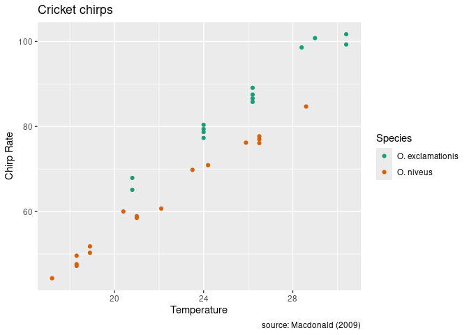<!-- -->

``` r
# Modifying basic properties of the plot
ggplot(crickets, aes(x = temp,
                     y = rate,
                     color = species)) + 
  geom_point(color = "red",
             size = 2,
             alpha = .3,
             shape = "square") +
  labs(x = "Temperature",
       y = "Chirp Rate",
       color = "Species",
       title = "Cricket chirps",
       caption="source: Macdonald (2009)") + 
  scale_color_brewer(palette = "Dark2")
```

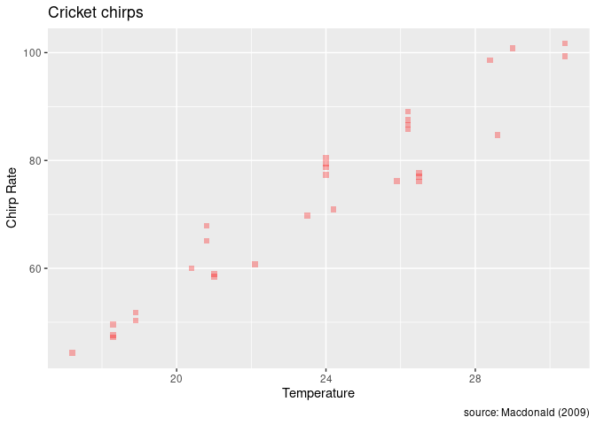<!-- -->

``` r
# Adding another layer
ggplot(crickets, aes(x = temp,
                     y = rate)) + 
  geom_point() +
  geom_smooth(method = "lm",
              se = F)
```

    ## `geom_smooth()` using formula = 'y ~ x'

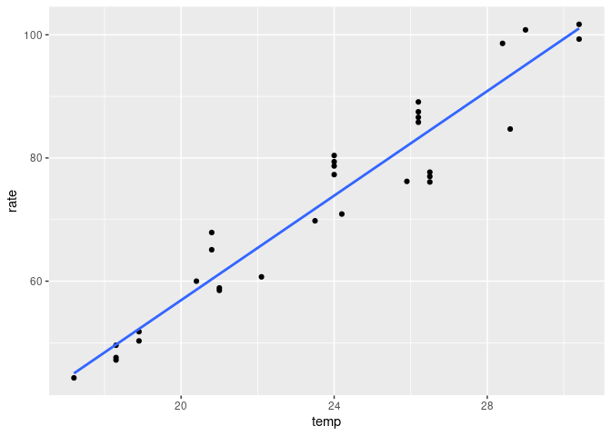<!-- -->

``` r
  labs(x = "Temperature",
       y = "Chirp Rate",
       color = "Species",
       title = "Cricket chirps",
       caption="source: Macdonald (2009)")
```

    ## $x
    ## [1] "Temperature"
    ## 
    ## $y
    ## [1] "Chirp Rate"
    ## 
    ## $colour
    ## [1] "Species"
    ## 
    ## $title
    ## [1] "Cricket chirps"
    ## 
    ## $caption
    ## [1] "source: Macdonald (2009)"
    ## 
    ## attr(,"class")
    ## [1] "labels"

``` r
ggplot(crickets, aes(x = temp,
                     y = rate,
                     color = species)) + 
  geom_point() +
  geom_smooth(method="lm",
              se = FALSE) +
  labs(x = "Temperature",
       y = "Chirp Rate",
       color = "Species",
       title = "Cricket chirps",
       caption="source: Macdonald (2009)") + 
  scale_color_brewer(palette = "Dark2")
```

    ## `geom_smooth()` using formula = 'y ~ x'

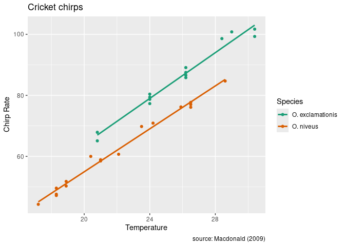<!-- -->

``` r
# Other plots
ggplot(crickets, aes(x = rate)) + 
  geom_histogram(bins = 15) # one quantitative variable
```

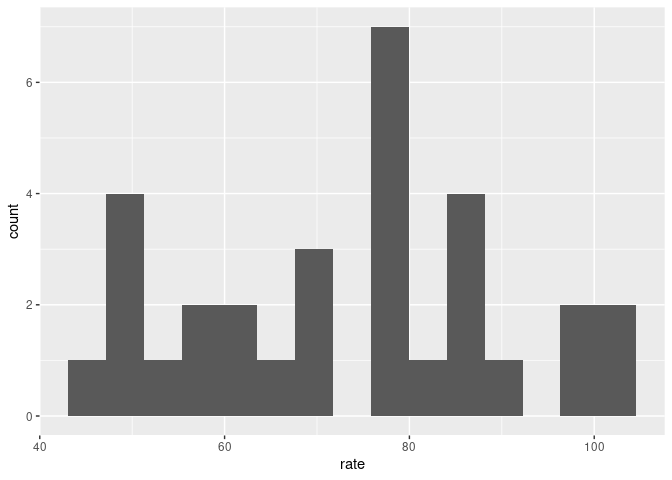<!-- -->

``` r
ggplot(crickets, aes(x = rate)) + 
  geom_freqpoly(bins = 15) # one quantitative variable
```

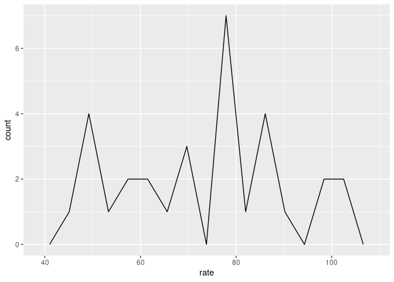<!-- -->

``` r
ggplot(crickets, aes(x = species)) + 
  geom_bar(color="black",
           fill="lightblue")
```

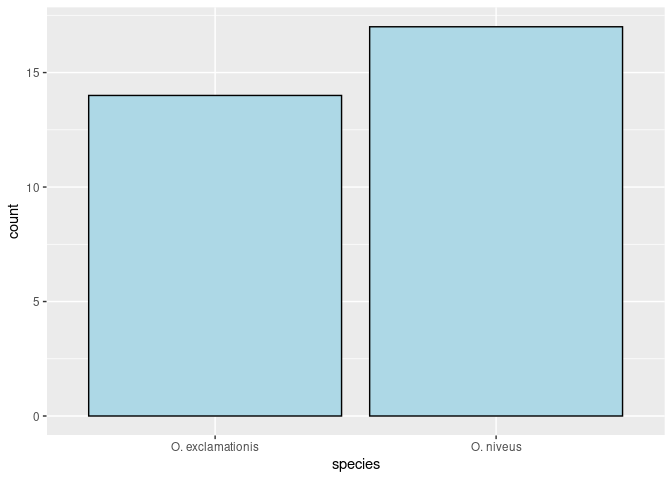<!-- -->

``` r
ggplot(crickets, aes(x = species,
                     fill = species)) + 
  geom_bar(show.legend = FALSE) + 
  scale_fill_brewer(palette = "Dark2")
```

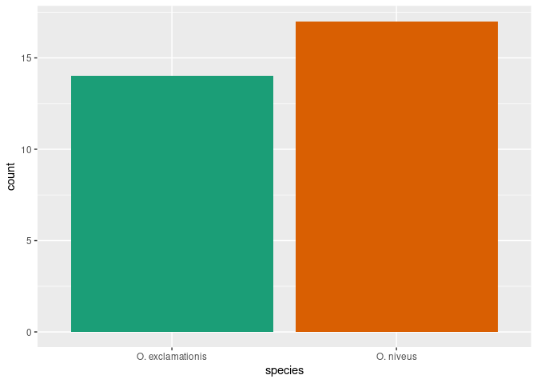<!-- -->

``` r
ggplot(crickets, aes(x = species,
                     y = rate,
                     color = species)) +
  geom_boxplot(show.legend = FALSE) +
  scale_color_brewer(palette = "Dark2") 
```

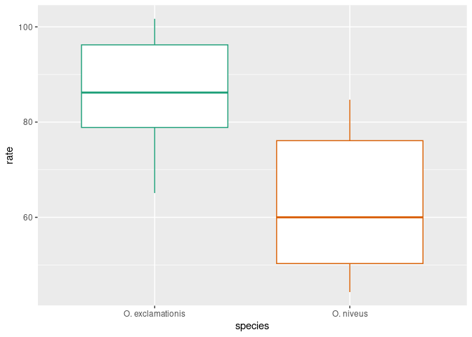<!-- -->

``` r
# faceting
ggplot(crickets, aes(x = rate,
                      fill=species)) +
  geom_histogram(bins=15) +
  scale_fill_brewer(palette = "Dark2")
```

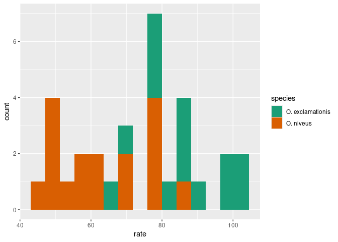<!-- -->

``` r
ggplot(crickets, aes(x = rate,
                     fill = species)) +
  geom_histogram(bins = 15,
                 show.legend = FALSE) + 
  facet_wrap(~species,
             ncol=1)+
  scale_fill_brewer(palette = "Dark2")
```

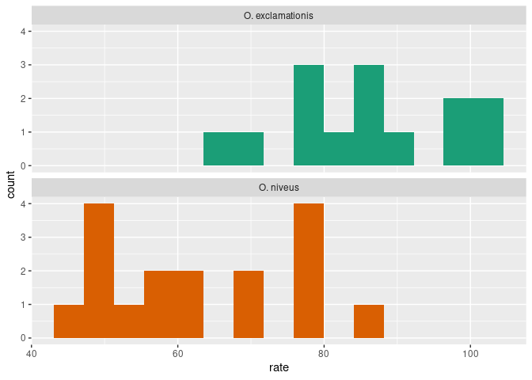<!-- -->
