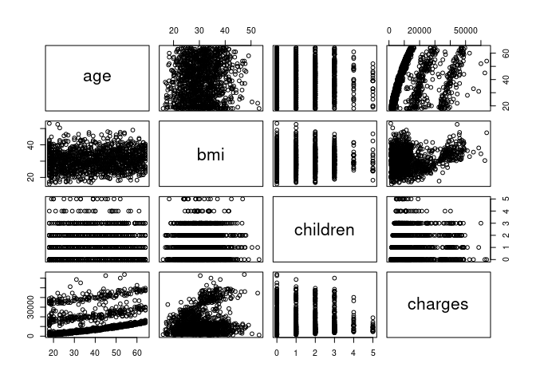
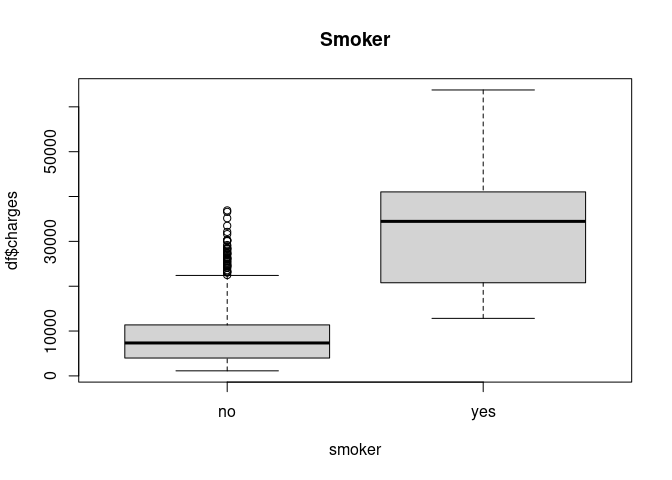
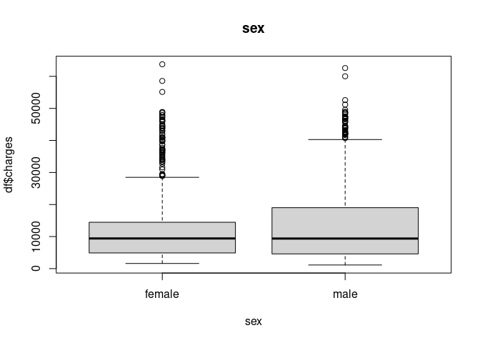
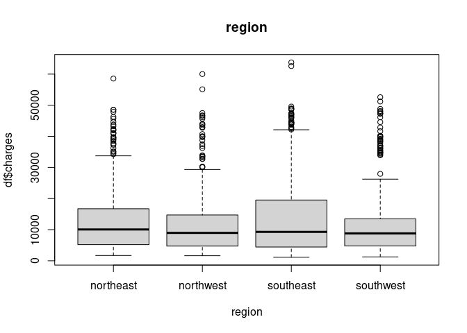

Medical Charge Predictions
================
2024-05-23

## Load the data

``` r
df = read.csv('insurance.csv', header=TRUE)
num_cols <- unlist(lapply(df, is.numeric))
plot(df[,num_cols])
```

<!-- -->

``` r
round(cor(df[,num_cols]), 2)
```

    ##           age  bmi children charges
    ## age      1.00 0.11     0.04    0.30
    ## bmi      0.11 1.00     0.01    0.20
    ## children 0.04 0.01     1.00    0.07
    ## charges  0.30 0.20     0.07    1.00

``` r
smoker = as.factor(df$smoker)
sex = as.factor(df$sex)
region = as.factor(df$region)
```

``` r
boxplot(df$charges ~ smoker, main='Smoker')
```

<!-- -->

``` r
boxplot(df$charges ~ sex, main='sex')
```

<!-- -->

``` r
boxplot(df$charges ~ region, main='region')
```

<!-- -->

``` r
model1 = lm(charges ~. , data=df)
```

``` r
summary(model1)
```

    ## 
    ## Call:
    ## lm(formula = charges ~ ., data = df)
    ## 
    ## Residuals:
    ##      Min       1Q   Median       3Q      Max 
    ## -11304.9  -2848.1   -982.1   1393.9  29992.8 
    ## 
    ## Coefficients:
    ##                 Estimate Std. Error t value Pr(>|t|)    
    ## (Intercept)     -11938.5      987.8 -12.086  < 2e-16 ***
    ## age                256.9       11.9  21.587  < 2e-16 ***
    ## sexmale           -131.3      332.9  -0.394 0.693348    
    ## bmi                339.2       28.6  11.860  < 2e-16 ***
    ## children           475.5      137.8   3.451 0.000577 ***
    ## smokeryes        23848.5      413.1  57.723  < 2e-16 ***
    ## regionnorthwest   -353.0      476.3  -0.741 0.458769    
    ## regionsoutheast  -1035.0      478.7  -2.162 0.030782 *  
    ## regionsouthwest   -960.0      477.9  -2.009 0.044765 *  
    ## ---
    ## Signif. codes:  0 '***' 0.001 '**' 0.01 '*' 0.05 '.' 0.1 ' ' 1
    ## 
    ## Residual standard error: 6062 on 1329 degrees of freedom
    ## Multiple R-squared:  0.7509, Adjusted R-squared:  0.7494 
    ## F-statistic: 500.8 on 8 and 1329 DF,  p-value: < 2.2e-16
